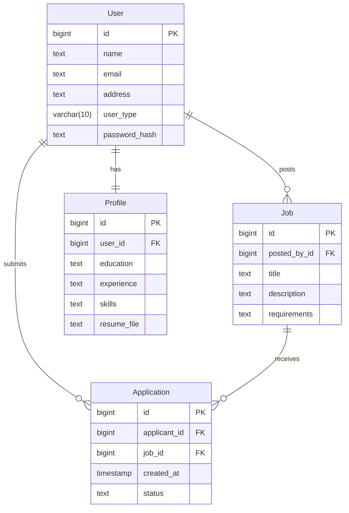

# 🚀 Advanced Job Application System

[](https://golang.org/doc/go1.20)
[](https://www.postgresql.org/)
[](https://www.docker.com/)

> 🌟 A sophisticated web-based application that revolutionizes the job application process using cutting-edge AI technology for resume parsing and intelligent job matching.

## 🎯 Features That Make Us Stand Out

- 📄 **Smart Resume Processing**
  - PDF & DOCX support
  - AI-powered parsing using Gemini-1.5-pro LLM
  - Automatic skill extraction and categorization
  
- 🔒 **Enterprise-Grade Security**
  - JWT authentication
  - Role-based access control
  - Encrypted data storage
  
- 🎯 **Intelligent Job Matching**
  - AI-driven skill matching
  - Automated candidate ranking
  - Smart recommendations

- 💾 **Robust Data Management**
  - PostgreSQL integration
  - Efficient query optimization
  - Data versioning

## 🏗 System Architecture

### Entity Relationship Diagram


## 🚀 Quick Start

### Prerequisites

Before you begin, ensure you have installed:
- 🔧 Go (1.20+)
- 🐘 PostgreSQL (14+)
- 🐳 Docker (optional)
- 🔑 Gemini API key

### 🛠 Installation

1. **Clone the repository**
```bash
git clone https://github.com/sonpalparmar/GolangAssignment.git
cd GolangAssignment
```

2. **Configure environment**
```bash
# Create .env file
cat << EOF > .env
DB_USER=your_db_user
DB_PASSWORD=your_db_password
DB_NAME=your_db_name
DB_HOST=localhost
DB_PORT=5432
API_KEY=your_gemini_api_key
EOF
```

3. **Install dependencies**
```bash
go mod tidy
```

4. **Run migrations**
```bash
go run cmd/app/main.go
```

## 📚 API Documentation

### Resume Upload Endpoint

```http
POST /uploadResume
Authorization: Bearer <token>
Content-Type: multipart/form-data

[file: resume.pdf]
```

#### Success Response
```json
{
  "status": "success",
  "message": "Resume uploaded and parsed successfully",
  "data": {
    "name": "John Doe",
    "email": "john.doe@example.com",
    "education": "Bachelor's in Computer Science",
    "skills": ["Golang", "Docker", "PostgreSQL"],
    "experience": [
      {
        "company": "XYZ Corp",
        "position": "Software Engineer",
        "duration": "2 years"
      }
    ]
  }
}
```

## 📁 Project Structure

```
📦 GolangAssignment
 ┣ 📂 cmd
 ┃ ┗ 📂 app
 ┃   ┗ 📜 main.go
 ┣ 📂 internal
 ┃ ┣ 📂 controllers
 ┃ ┃ ┗ 📜 applicant_controller.go
 ┃ ┣ 📂 models
 ┃ ┃ ┗ 📜 user.go
 ┃ ┗ 📂 middlewares
 ┃   ┗ 📜 auth_middleware.go
 ┣ 📂 config
 ┃ ┗ 📜 config.go
 ┗ 📂 pkg
   ┗ 📂 utils
     ┗ 📜 jwt.go
```

## 🔥 Advanced Features

### 1. 🤖 AI-Powered Resume Analysis
- Sentiment analysis of work experiences
- Skill relevance scoring
- Career progression analysis

### 2. 📊 Analytics Dashboard
- Application success rates
- Skill demand trends
- Candidate demographics

### 3. 🔄 Real-time Updates
- WebSocket integration for instant notifications
- Live application status tracking
- Real-time chat support

### 4. 🎯 Smart Job Matching
- ML-based candidate-job matching
- Automated skill gap analysis
- Personalized job recommendations

## 🛡 Security Features

- 🔐 Password hashing using Argon2
- 🔑 JWT token rotation
- 🛑 Rate limiting
- 🔍 SQL injection prevention
- 🚫 XSS protection

## 🔧 Technology Stack

- **Backend**: Go, Gin Framework
- **Database**: PostgreSQL
- **AI/ML**: Gemini-1.5-pro
- **Authentication**: JWT
- **Containerization**: Docker
- **Documentation**: Swagger/OpenAPI

## 🤝 Contributing

We welcome contributions! Here's how you can help:

1. 🍴 Fork the repository
2. 🔧 Make your changes
3. ✅ Run tests
4. 📫 Submit a pull request

## 📝 License

This project is licensed under the MIT License - see the [LICENSE](LICENSE) file for details.

## ⭐ Support

If you find this project helpful, please consider giving it a star! It helps make the project more visible and encourages further development.

---

<div align="center">
  
  **Built with ❤️ by [Sonpal Parmar]**
  
  [](https://github.com/sonpalparmar/GolangAssignment/stargazers)
  [](https://github.com/sonpalparmar/GolangAssignment/network/members)
  
</div>
