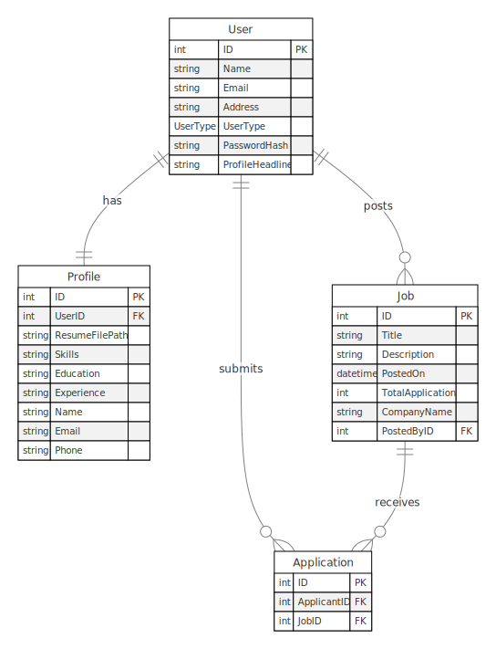

# Job Application System

## Architecture Overview

This system is designed to manage job postings, user profiles, and job applications. Below is an entity-relationship diagram representing the architecture and relationships between the main entities in the system.

## Entities and Relationships

### User
- The central entity in the system.
- Represents both job applicants and job posters (admins).
- Has a one-to-one relationship with Profile.
- Can post multiple Jobs (one-to-many).
- Can submit multiple Applications (one-to-many).

### Profile
- Contains detailed information about a user.
- Has a one-to-one relationship with User.

### Job
- Represents a job posting in the system.
- Posted by a User (many-to-one with User).
- Can receive multiple Applications (one-to-many).

### Application
- Represents a job application submitted by a user for a specific job.
- Acts as a join table between User and Job.
- Has a many-to-one relationship with both User and Job.

## Key Relationships

1. User - Profile: One-to-One
   - Each User has exactly one Profile.
   - The Profile table has a foreign key (UserID) referencing the User table.

2. User - Job: One-to-Many
   - A User (Admin) can post multiple Jobs.
   - The Job table has a foreign key (PostedByID) referencing the User table.

3. User - Application: One-to-Many
   - A User (Applicant) can submit multiple Applications.
   - The Application table has a foreign key (ApplicantID) referencing the User table.

4. Job - Application: One-to-Many
   - A Job can receive multiple Applications.
   - The Application table has a foreign key (JobID) referencing the Job table.

This architecture allows for a flexible and scalable job application system, where users can create profiles, post jobs, and apply for positions.

